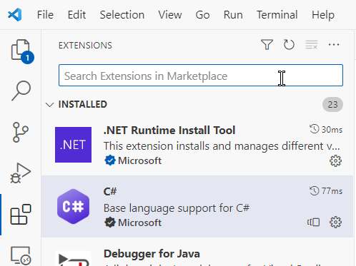
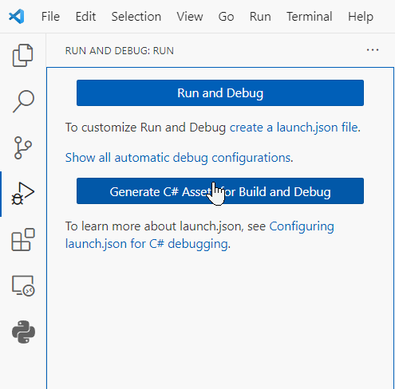
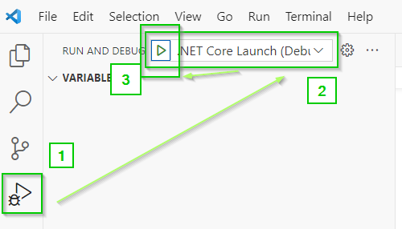
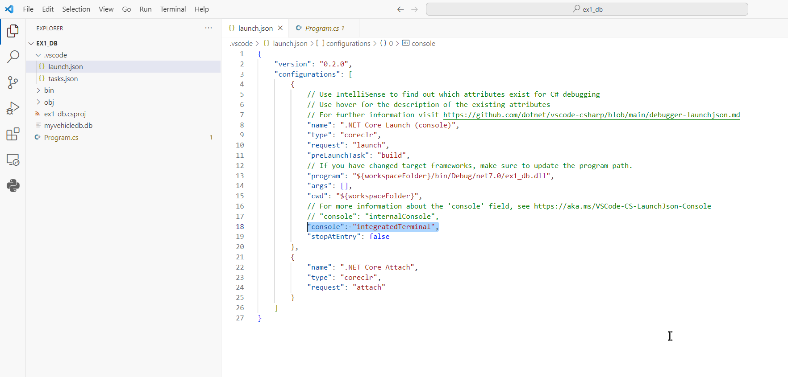

# 1. Prerequisites
1. VSCode
2. Extensions:<br/>
a. .NET Runtime Install Tool (v1.7.3)<br/>
b. C# (v2.1.2)

## 1.1 Installing VSCode
No idea. Do it yourself !

## 1.2 Installing extension


# Create a new solution (containing new projects):

## 2. CLI:
```bash
dotnet new sln -n <SolutionName>
dotnet new console --name <ProjectName1> --output <ProjectName1>
dotnet sln add .\<ProjectName1>\<ProjectName1>.csproj
dotnet new console --name <ProjectName2> --output <ProjectName2>
dotnet sln add .\<ProjectName2>\<ProjectName2>.csproj
dotnet restore
dotnet build <SolutionName>.sln
```
Details:
1. `dotnet new sln -n <SolutionName>`
   - This command creates a new .NET solution with a specified name `<SolutionName>` using the `dotnet new sln` command. The `-n` option specifies the name of the solution.

2. `dotnet new console --name <ProjectName1> --output <ProjectName1>`
   - This command creates the first console application project with a specified name `<ProjectName1>` and specifies the output directory as `<ProjectName1>`. The `--name` option sets the name of the project, and the `--output` option sets the output directory.

3. `dotnet sln add .\<ProjectName1>\<ProjectName1>.csproj`
   - This command adds the first project to the solution using the `dotnet sln add` command. It specifies the path to the .csproj file for the first project, which is located in the `<ProjectName1>` directory.

4. `dotnet new console --name <ProjectName2> --output <ProjectName2>`
   - This command creates the second console application project with a specified name `<ProjectName2>` and specifies the output directory as `<ProjectName2>`.

5. `dotnet sln add .\<ProjectName2>\<ProjectName2>.csproj`
   - Similarly, this command adds the second project to the solution by specifying the path to the .csproj file for the second project, which is located in the `<ProjectName2>` directory.

6. `dotnet restore`
   - This command is used to restore the dependencies for both projects within the solution. It fetches the necessary NuGet packages required by the projects and restores them.

7. `dotnet build <SolutionName>.sln`
   - Finally, this command builds the entire solution with the specified name `<SolutionName>`, which includes both the first and second projects. It compiles the code and generates executable files if there are no build errors.

## Links about creating solution:
- [→ stackoverflow: net-core-when-to-use-dotnet-new-sln ←](https://stackoverflow.com/questions/42730877/net-core-when-to-use-dotnet-new-sln)

- [(Microsoft: dotnet-sln)](https://learn.microsoft.com/en-us/dotnet/core/tools/dotnet-sln)

# 3. Add NuGet
`Important:` Move into the project folder:
```bash
cd .\ex1_db\  
```
Add the package:
```bash
cd .\ex1_db\  
dotnet add package Microsoft.Data.Sqlite  
```
## Microsoft doc about NuGet:
- [Install and manage NuGet packages with the dotnet CLI](https://learn.microsoft.com/en-us/nuget/consume-packages/install-use-packages-dotnet-cli)<br/>

# 4. Recompile
1. Select your program file (Program.cs)

2. If first time:<br/>
<br/><br/>

3. Press the debug button (number 3 below):<br/>


# 5. Debugging and make Console.ReadLine() works


## link
[stackoverflow:debug-console-window-cannot-accept-console-readline-input-during-debugging](https://stackoverflow.com/questions/41195432/debug-console-window-cannot-accept-console-readline-input-during-debugging)
